# 环境搭建

默认账号密码 admin / admin

```
docker volume create --name=myscan_db
docker-compose up -d
./run_mysql.sh
```

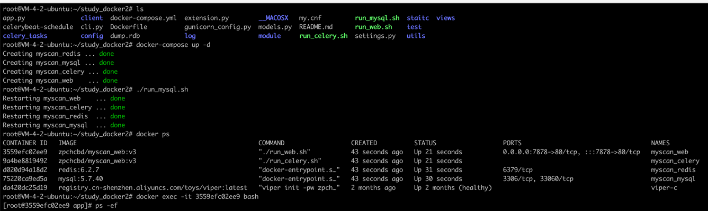

数据库初始化

```
docker exec -it myscan_web bash
export PATH=$PATH:/usr/local/python3/bin
flask create
```

##注意事项

- 如果想要支持ksubdomain信息搜集，请在vue-myscan的目录下运行如下命令

```
wget https://github.com/boy-hack/ksubdomain/releases/download/v1.9.5/KSubdomain-v1.9.5-linux.tar
tar -xvf KSubdomain-v1.9.5-linux.tar
mv ./ksubdomain ./client/ksubdomain/ksubdomain
chmod +x ./client/ksubdomain/ksubdomain
rm KSubdomain-v1.9.5-linux.tar
```

- 为了安全jwt记得自己更换一次，密钥文件位于settings.py

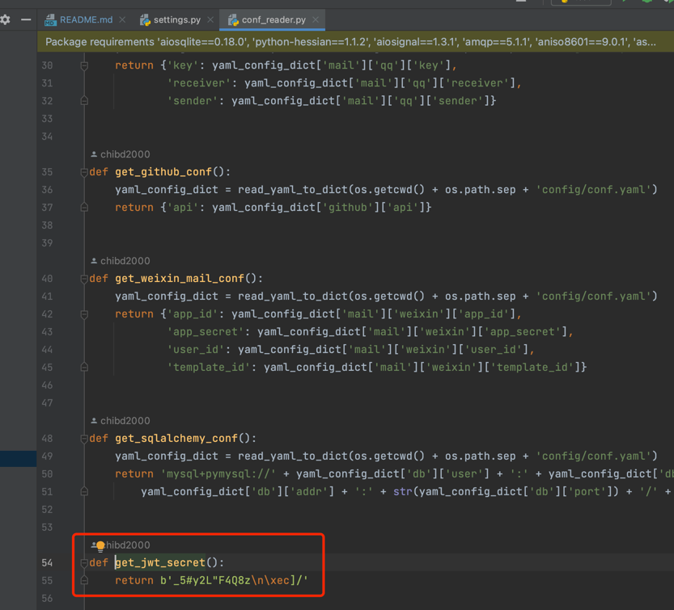

## 配置文件

- config/conf.yaml

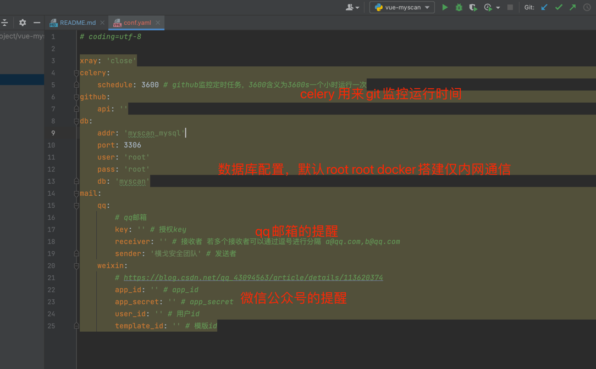

- client/conf/myscan.yaml


登陆口

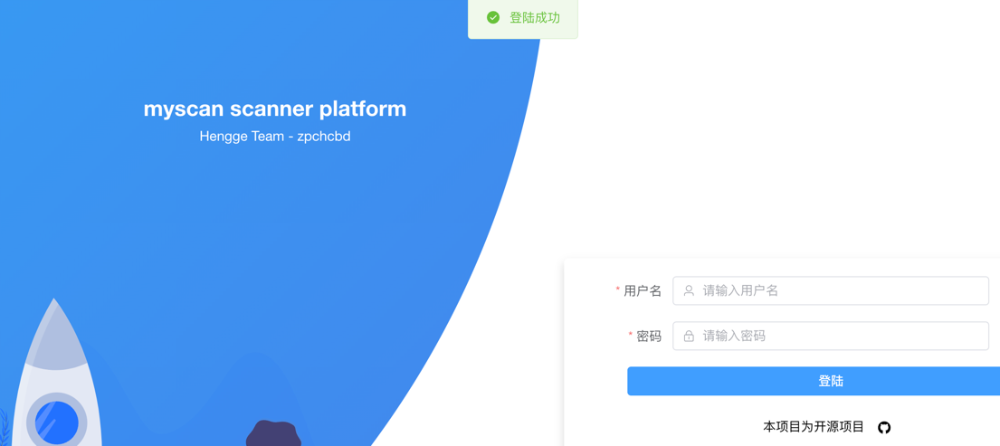

页面布局如下所示

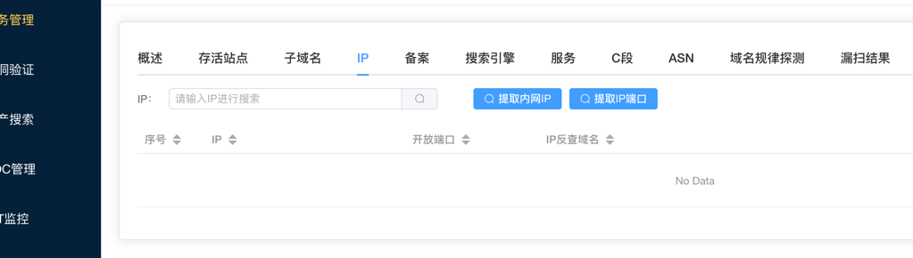

# 扫描

## 信息搜集

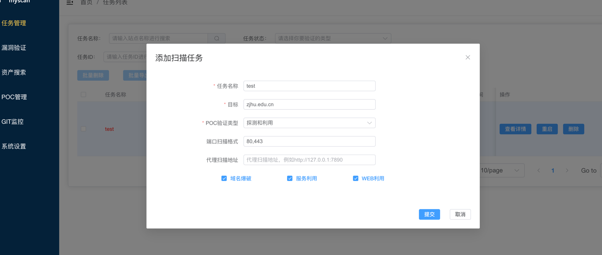


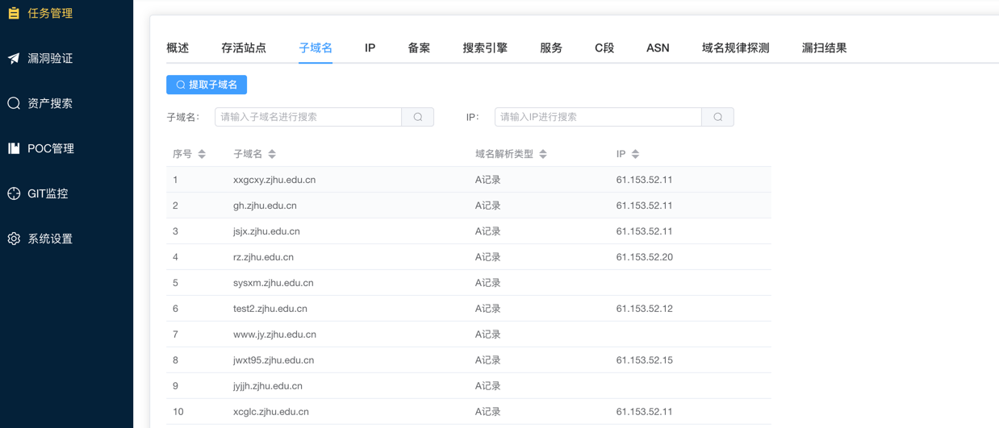

## 漏洞验证

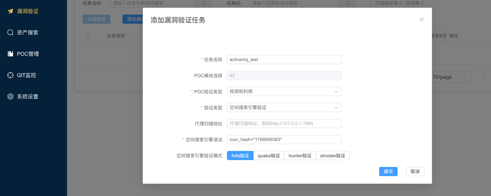

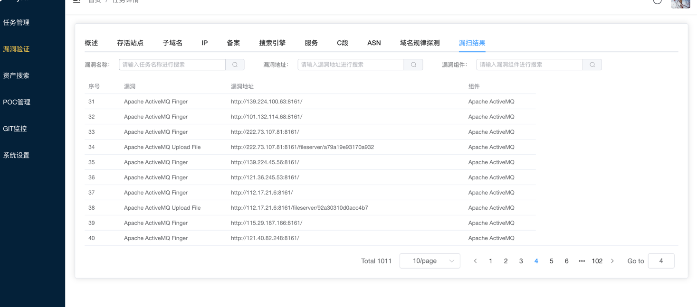

# github commit & pr & issue 监控

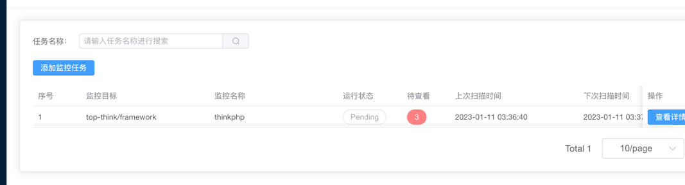

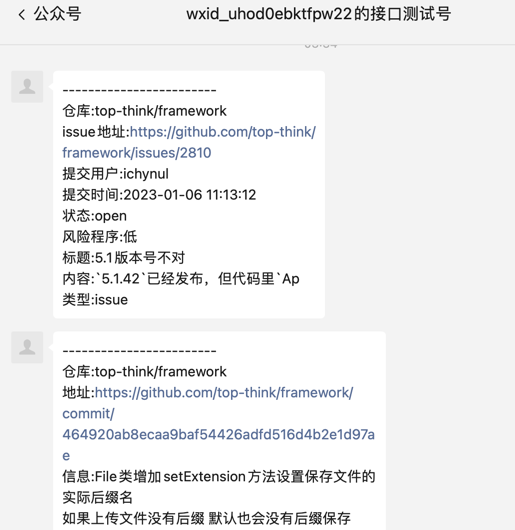


