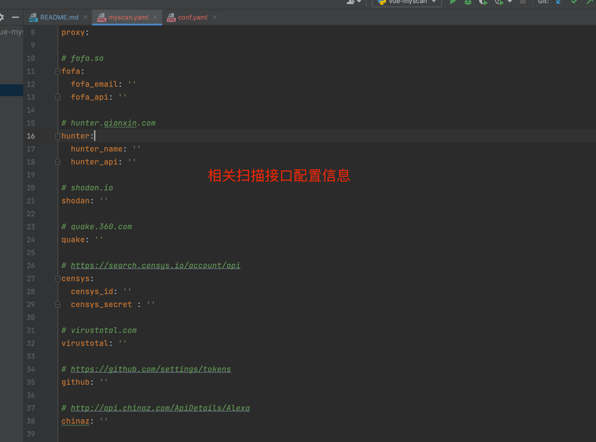
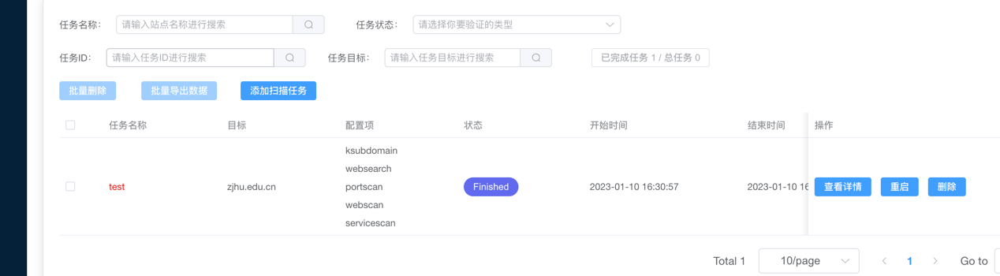

# 环境搭建

默认账号密码 admin / admin ，为了安全jwt记得自己更换一次，密钥文件位于settings.py

```docker-compose up -d```

遇到这种下面ip的标签页为空的话，重新运行一次run_mysql.sh

```./run_mysql.sh```


登陆口


页面布局如下所示


# 配置文件

- config/conf.yaml


- client/conf/myscan.yaml



# 扫描

## 信息搜集





## 漏洞验证


# github commit & pr & issue 监控


